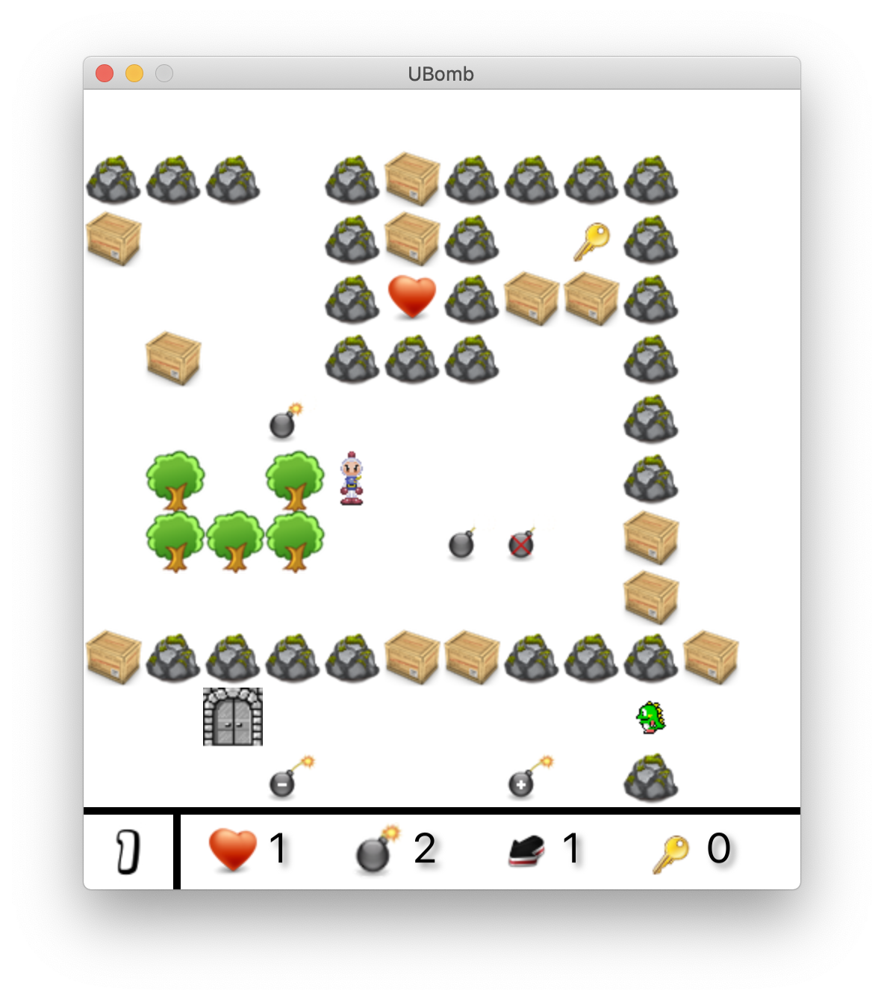

<link rel="stylesheet" href="readme.css">

# Projet de POO

Réalisation d'un jeu vidéo 2D : **UBomb**.

## Principes du jeu

Une princesse est détenue prisonnière par de méchants monstres verts. Votre mission, si vous l'acceptez, est d'aller la délivrer. Pour cela, vous devrez traverser plusieurs mondes, plus effrayants les uns que les autres. Des portes vous permettront de passer de mondes en mondes. Certaines portes seront fermées à clés et nécessiteront d'avoir une clé dans votre inventaire. Vous êtes un expert en explosif et utiliserez vos bombes pour détruire les obstacles devant vous et tuer les monstres qui vous attaqueront.

## Représentation du jeu

Chaque monde est représenté par une carte (rectangulaire) composée de cellules. Chaque cellule peut contenir :

-   le joueur ;
-   la princesse ;
-   des monstres ;
-   des éléments de décor (arbres, pierres...) infranchissables et
    indestructibles ;
-   des caisses destructibles et déplaçables ; 
-   des portes, ouvertes ou fermées, permettant d’évoluer entre les
    mondes ;
-   des clés pour débloquer les portes fermées ;
-   des bonus ou des malus qu'il est possible de ramasser.

## Prise en main

Nous vous fournissons une première ébauche du jeu, utilisant la bibliothère JavaFX. Le lancement du jeu
fait apparaître une carte minimaliste, chargée statiquement en mémoire, dans laquelle le joueur peut se déplacer dans toutes les directions quelque soit la nature des cellules. Le code utilise `gradle` comme moteur de production. Il suffit de lancer la commande suivante pour compiler et exécuter le jeu. Toutes les dépendances seront automatiquement téléchargées et installées. Le jeu nécessite une version de Java au moins égale à 11.

    $ ./gradlew run

Travail à fournir
=================

## Premiers pas

Ajouter l'affichage de tous les éléments (caisses, bonus, clés...) ainsi que les monstres et la princesse. Pour le moment, les monstres ne savent pas marcher, ils ne bougent pas. Modifier le code pour que les mouvements du joueur soient limités par le cadre de la carte, les éléments de décor et les caisses. 
Le joueur peut marcher sur une case où se trouve un bonus, une clé, ou un autre personnage. Faire en sorte que le joueur perde une vie lorsqu'il se trouve sur la même case qu'un monstre.
S’il atteint la princesse, la partie se termine par une victoire.
Si ses points de vie tombent à 0, la partie se termine par une défaite.

## Gestion du panneau d’informations

Le panneau d’information doit afficher le nombre de vies, le nombre de bombes et leur portée, le nombre de clés dans l’inventaire et le numéro de niveau courant.

## Gestion des mondes

Le dossier de ressources `sample` contient les cartes correspondant à trois niveaux. La configuration du jeux est fournie dans le fichier de propriété `config.properties`. Nous définissons les conventions suivantes :

-   les cartes sont stockées sous forme de fichiers texte afin de
    pouvoir les créer et les modifier avec un simple éditeur de texte ;
-   le nom de fichier d’une carte est de la forme `<prefix>N.txt` où `N` est le
    numéro du niveau et `<prefix>` est la valeur du champ `prefix` dans le fichier de configuration ;
-   la case en haut à gauche de la carte correspond aux coordonnées
    `(0,0)` ;
-   chaque ligne correspond à une ligne de cellule sur la carte ; 
-   chaque cellule de la carte est définie en respectant le codage
défini dans le fichier `WorldEntity.java`.

Modifier le code dans le package classe `game` pour que le monde du jeu soit chargé depuis les fichiers du dossier `world`.

## Gestion des portes

Lorsque le joueur arrive sur la case d’une porte ouverte, il passe
automatiquement au niveau correspondant à cette porte (niveau supérieur
ou inférieur). Il se retrouve automatiquement sur la porte du niveau
correspondant. Seul le niveau *0* (on ne peut pas passer au niveau inférieur) et le dernier (on ne peut pas aller plus loin) n'ont qu'une seule porte.  Si la porte est fermée, le joueur doit utiliser une des
clés de son inventaire. Pour ce faire, il doit appuyer sur la touche `[ENTER]` lorsqu'il est à côté de la porte à ouvrir et qu'il regarde la porte. Une fois utilisée, la clé disparaît de
l’inventaire. Chaque clé peut ouvrir indifféremment n’importe quelle
porte fermée. Une fois qu'une porte est ouverte, elle le reste pour toute la partie du jeu.

## Déplacement des caisses

 Les caisses doivent pouvoir être déplacées par le joueur si rien ne gêne dans le sens de la poussée. Le joueur ne peut déplacer qu'une seule caisse à la fois. Si un bonus se trouve dans la direction déplacement d’une caisse, la caisse reste bloquée. Le joueur ne peut pas déplacer deux caisses à la fois. 

## Gestion des bombes

Lorsque le joueur presse la touche `[ESPACE]`, il dépose une bombe sur
la case sur laquelle il se trouve, déclenchant une explosion au bout de
4 secondes. La mèche de la bombe diminue à chaque seconde. La portée de
la bombe est par défaut de 1 case, en croix (case du dessus, case du
dessous, case de gauche, case de droite). Les éléments de décor stoppent
la propagation de l’explosion dans le sens qu’ils obstruent. Si une caisse est sur le chemin de l’explosion, elle
disparaît. Une explosion ne peut
détruire qu’une seule caisse dans une même direction. Si un bonus (ou un malus) se trouve sur le chemin de l’explosion, il disparaît. 
Enfin, si un joueur ou un monstre est sur une cellule touchée par une explosion, il
perd une vie. Les explosions n’ont aucun effet sur les portes et les
clés. Lorsque une bombe explose, une nouvelle bombe est ajoutée à
l’inventaire du joueur. 

Si le joueur pose une bombe et change ensuite de niveau en franchissant une porte, la bombe doit tout de même exploser au bout de 4 secondes. Les éléments de décor détruits sur un niveau doivent le rester pendant toute la durée de la partie.

## Gestion des bonus et malus

Le joueur ramasse automatiquement un bonus lorsqu'il marche sur la case qui le contient. Les monstrent peuvent marcher sur les cases des bonus mais ne peuvent pas les ramasser. Il existe 5 bonus différents :

Bonus | Effet
--- | --- |
 | Augmente la capacité du sac de bombe de une unité. |
 | Diminue la capacité du sac de bombe de une unité. Le sac contient toujours au minimum une bombre |
|  | Augmente la portée des bombes de une unité. La modification de portée n'affecte pas les bombes déjà posées. |
|  | Diminue la portée des bombes de une unité. La portée minimale est de un. La modification de portée n'affecte pas les bombes déjà posées. |
|  | Ajoute une vie. |

## Gestion des vies

Le nombre initial de vies du joueur est défini dans le fichier de configuration. Il peut en perdre s’il
se trouve sur une case à portée de l’explosion d’une bombe ou s'il croise un monstre. Si le joueur
n’a plus de vie, la partie se termine. Le joueur bénéficie alors d’une temporisation d'une seconde pendant laquelle il est invulnérable.

## Gestion des monstres

Les déplacements des monstres sont
entièrement aléatoires. Une collision avec un monstre déclenche la perte
d’une vie. Commencer par ajouter un seul monstre à la fois, puis augmenter le
nombre de monstres. Les monstres ne peuvent pas ramasser les bonus qui se trouvent sur le
sol. Les monstres ont peur des portes et ne peuvent pas les franchir.

**Pour aller plus loin.** Faire en sorte que la vitesse de déplacement des monstres soit faible dans les premiers niveaux et augmente plus on se rapproche de la
princesse. Ajouter ensuite un module d’intelligence artificielle pour que les monstres des derniers niveaux se dirigent vers le joueur et non plus de manière aléatoire.

## Fin de partie

La partie est finie lorsque le joueur arrive sur la case de la
princesse. Les monstres ne veulent pas de mal à la princesse mais feront
tout pour la garder prisonnière. La touche `[ESCAPE]` permet de quitter la partie à tout moment.
